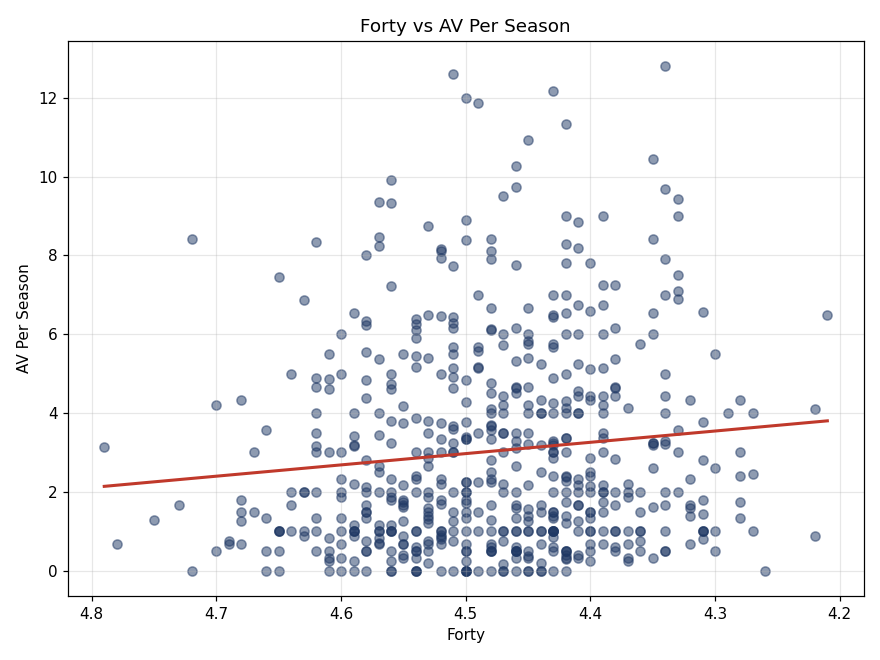

# NFL Wide Receiver Combine Analysis

## Project Goal
Investigate whether NFL Scouting Combine metrics can predict a wide receiver's NFL career success.

## Methods
- Data cleaning and preprocessing (merging combine testing data with career stats by player name + draft year)
- Exploratory visualization
- Multiple linear regression
- Speed and explosion (jumping) sub-analyses

## Key Findings
The 40-yard dash showed the strongest relationship with career success (Career AV per season), though the correlation is weak (r ≈ -0.11, p ≈ 0.01 — faster times are associated with modestly higher career value). Combine metrics as a whole have limited predictive power: the full six-metric regression model explains under 4% of the variance in career performance (R² ≈ 0.04). Vertical jump and broad jump ("explosion" metrics) show a similarly weak relationship on their own.

**Takeaway:** athletic testing at the combine is, at best, a weak standalone predictor of NFL receiver success — consistent with the broader analytics conversation around how much combine performance actually matters versus college production, scheme fit, and landing spot.

### Preview



*(Preview plots in `preview/` were rendered separately to display here; running `analysis.R` regenerates the authoritative ggplot2 versions in `plots/`.)*

## Data Sources
- Career stats: [Pro Football Reference / Stathead Player Season Finder](https://www.sports-reference.com/stathead/football/player-season-finder.cgi) (WRs drafted 2000+)
- Combine testing data: [NFL Combine Data 2000–2025 (Kaggle)](https://www.kaggle.com/datasets/isaaksipple/nfl-combine-2000-2025)

Full citations are in [`References.docx`](References.docx).

## Technologies Used
R, dplyr, ggplot2, readr, readxl, stringr

## Repository Structure
```
├── analysis.R          # Full analysis script
├── data/
│   ├── sportsref_download.xlsx
│   └── NFL_Combine_Since_2000.csv
├── plots/               # Generated by analysis.R (ggplot2 output)
├── preview/             # Static preview images for this README
├── References.docx
└── README.md
```

## Running It
Open `NFL_WR_Project.Rproj` in RStudio (or run from the project root), then:
```r
install.packages(c("dplyr", "ggplot2", "readr", "readxl", "stringr"))
source("analysis.R")
```
